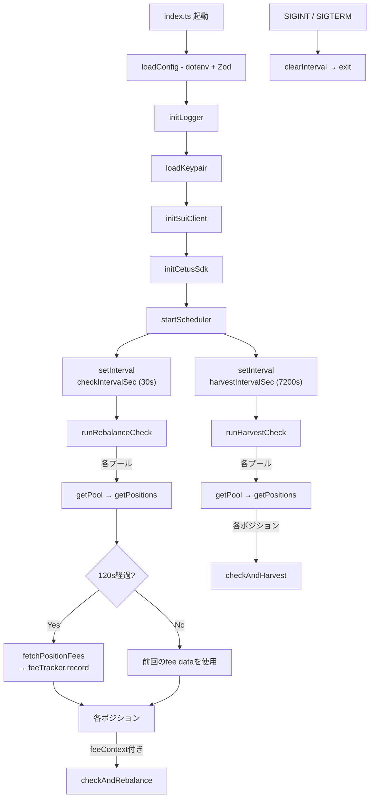
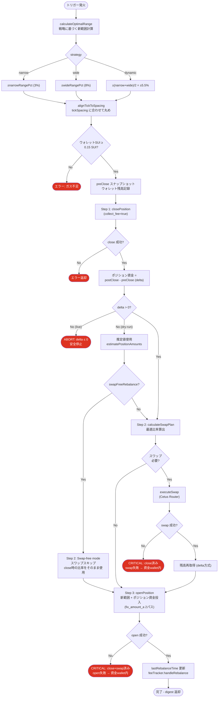
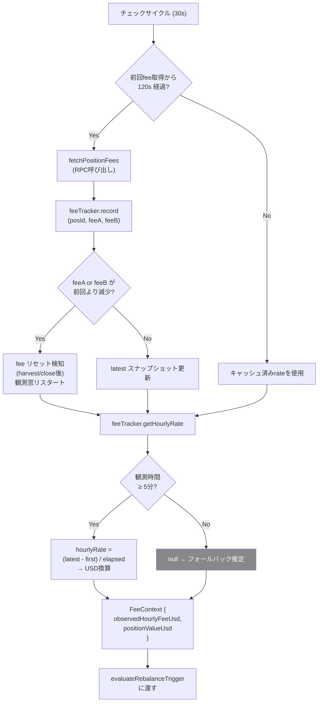
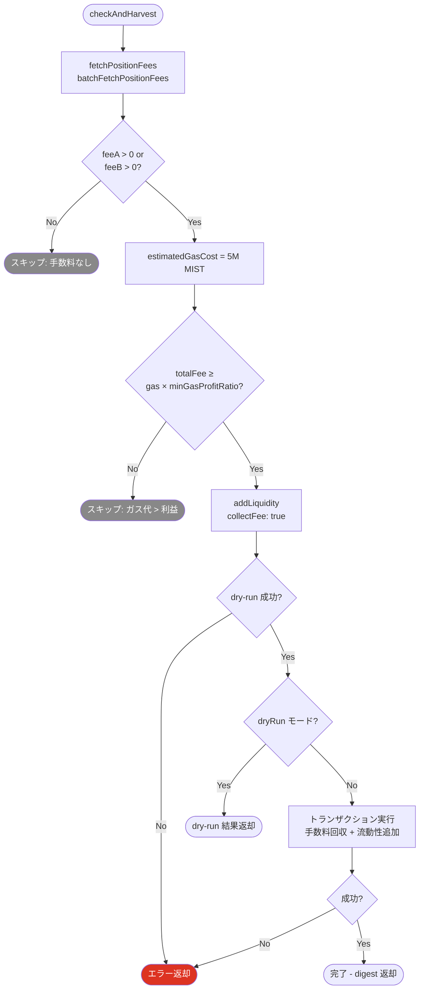
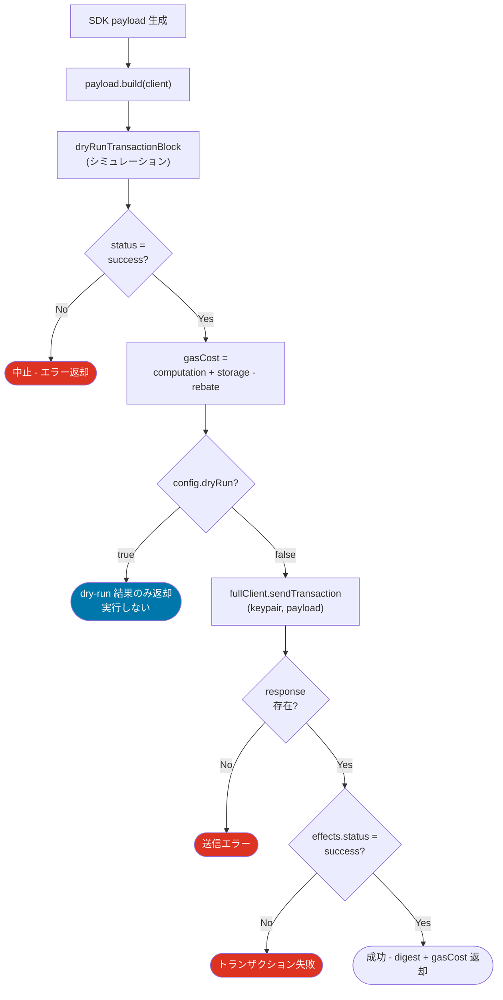
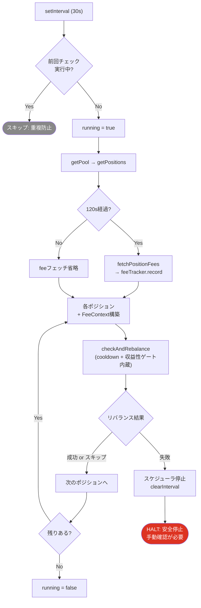
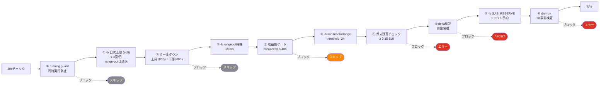
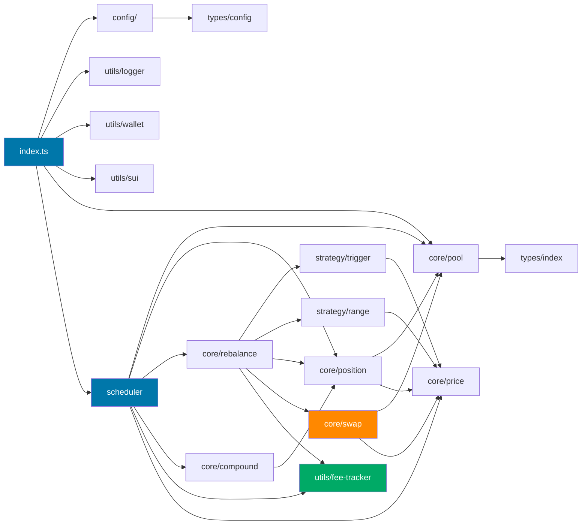
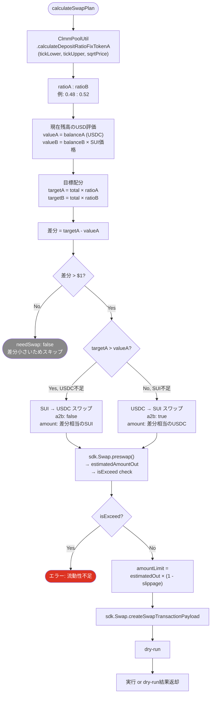
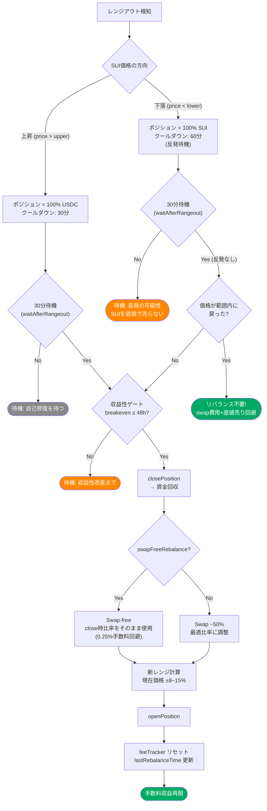

# Sui Auto LP - Logic Flow

## System Overview



## Rebalance Trigger Flow

```mermaid
flowchart TD
    Start([evaluateRebalanceTrigger]) --> Direction{"range-out<br/>方向判定"}

    Direction --> CooldownCheck{クールダウン<br/>経過?}

    CooldownCheck -->|"上昇 or 通常:<br/>1800s未満"| CooldownSkip(["スキップ: クールダウン中"])
    CooldownCheck -->|"下落:<br/>3600s未満"| CooldownDown(["スキップ: 下落クールダウン中<br/>(反発待機 60分)"])

    CooldownCheck -->|"経過済み or 初回"| DailyLimit{"日次上限<br/>チェック"}

    DailyLimit -->|"上限到達 &<br/>range内"| SoftBlock(["ソフトブロック:<br/>threshold/time-based 停止"])
    DailyLimit -->|"上限到達 &<br/>range外"| RangeOut
    DailyLimit -->|"上限未到達"| RangeOut

    RangeOut{現在価格が<br/>LP範囲外?}

    RangeOut -->|"Yes (下落)"| DownGate["下落 range-out<br/>ポジション = 100% SUI"]
    RangeOut -->|"Yes (上昇)"| UpGate["上昇 range-out<br/>ポジション = 100% USDC"]

    DownGate --> ProfitGate{"収益性ゲート<br/>breakeven ≤ 12h?"}
    UpGate --> ProfitGate

    ProfitGate -->|"実測データあり"| CalcReal["breakeven =<br/>swapCost / observedHourlyFeeUsd"]
    ProfitGate -->|"データ不足"| CalcFallback["breakeven =<br/>推定モデル (フォールバック)"]

    CalcReal --> BECheck{breakeven<br/>≤ 48h?}
    CalcFallback --> BECheck

    BECheck -->|No| ProfitSkip(["スキップ: 赤字リバランス回避"])
    BECheck -->|Yes| Triggered[shouldRebalance = true<br/>trigger: range-out]

    RangeOut -->|No| ClearDir["方向トラッキング<br/>クリア (範囲内復帰)"]
    ClearDir --> Threshold{範囲端から<br/>threshold(10%) 以内?}

    Threshold -->|Yes| Triggered2[shouldRebalance = true<br/>trigger: threshold]
    Threshold -->|No| TimeBased{前回リバランスから<br/>interval 経過?}

    TimeBased -->|Yes| Triggered3[shouldRebalance = true<br/>trigger: time-based]
    TimeBased -->|No| Skip([スキップ])

    style SoftBlock fill:#888,color:#fff
    style CooldownSkip fill:#888,color:#fff
    style CooldownDown fill:#f80,color:#fff
    style ProfitSkip fill:#f80,color:#fff
    style Skip fill:#888,color:#fff
    style DownGate fill:#d32,color:#fff
    style UpGate fill:#07a,color:#fff
```

## Rebalance Execution Flow



## Fee Tracking Flow



## Harvest Flow



## Transaction Safety Flow



## Scheduler Safety



## Protection Layers



## Module Dependency



## Swap & Optimal Ratio Flow



## Out-of-Range Behavior (Asymmetric)



## Default Parameters (Current)

| パラメータ | 値 | 説明 |
|---|---|---|
| `checkIntervalSec` | 30s | プール状態チェック間隔 |
| `harvestIntervalSec` | 7200s (2h) | ハーベスト（手数料claim）チェック間隔 |
| `narrowRangePct` | ±8% | ナローレンジ幅 |
| `wideRangePct` | ±15% | ワイドレンジ幅 |
| `rebalanceThreshold` | 3% (推奨: 10%) | 範囲端からのリバランス閾値 |
| `COOLDOWN_UP_SEC` | 1800s (30min) | 上昇時のリバランスクールダウン |
| `COOLDOWN_DOWN_SEC` | 3600s (60min) | 下落時のリバランスクールダウン（反発待機） |
| `waitAfterRangeoutSec` | 1800s (30min) | レンジアウト検出後の待機時間 |
| `maxRebalancesPerDay` | 3 | 1日あたり最大リバランス回数 |
| `minTimeInRangeSec` | 7200s (2h) | 新ポジション開設後の最低レンジ内時間（threshold用） |
| `FEE_FETCH_INTERVAL_SEC` | 120s (2min) | fee RPC呼び出し間隔 |
| `maxBreakevenHours` | 48h | 収益性ゲート閾値 |
| `slippageTolerance` | 1% | スリッページ上限 |
| `MIN_SUI_FOR_GAS` | 0.15 SUI | ガス残高最低要件（プリフライトチェック） |
| `GAS_RESERVE` | 1.0 SUI | ポジション資金から予約（ウォレット残高を1 SUI以上に維持） |
| `swapFreeRebalance` | true | リバランス時のスワップスキップ（0.25%手数料回避） |
| `swapFreeMaxRatioSwap` | 10% (range-out: 50%) | swap-free 時の ratio-correction スワップ上限 |
| `maxIdleSwapRatio` | 20% | idle deploy 時のスワップ上限（超過分は部分投入） |
| `volTickWidthMin/Max` | 480/1200 | ボラティリティベースのtick幅下限/上限 |
